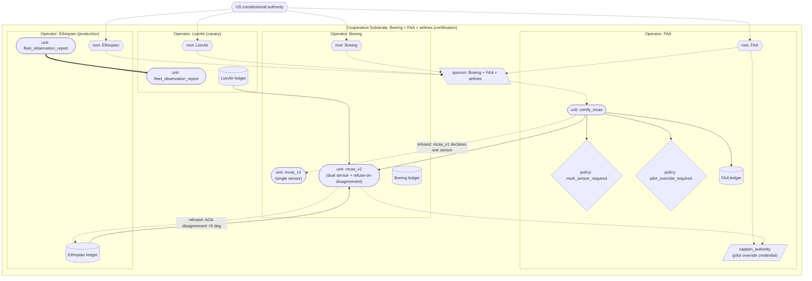

# Boeing 737 MAX (MCAS)

A model of the Boeing 737 MAX MCAS failure that killed 346 people across Lion Air 610 (Oct 2018) and Ethiopian Airlines 302 (Mar 2019). Demonstrates the substrate's claims in a safety-critical certification domain — distinct from welfare (Universal Credit, Robodebt), IT operational (Horizon), military (Lavender), and supply chain (SolarWinds, CrowdStrike) cases.

The most novel substrate property exercised: **certification-as-joint-witnessing**. The cooperative substrate makes the manufacturer + regulator + operator a quorum on each certification. The 'designated engineering representative' shortcut that effectively let Boeing self-certify MCAS becomes structurally impossible.

## What this demonstrates

- **Certification as a substrate pattern**: certification is a regular functional unit (`certify_mcas`) that fetches a candidate unit, inspects its declared structure, and invokes the FAA's cert policy units as sub-units. It is parallel to the backtest pattern — a backtest unit inspects ledger history; a certification unit inspects a candidate unit's structure. Neither is a new primitive. Each certification is a substrate act on the FAA's ledger: a permit (certified) or a refusal (denied), fully attributed. Certification is **not** a compile-time refusal — `mcas_v1` is a well-formed unit and compiles; what it fails is certification, which is a separate witnessed act. It is also **not** a runtime invocation policy — those evaluate against an invocation's inputs (a flight's AOA readings), whereas certification gates the unit's *structure*.
- **Structural certification policies**: the FAA's certification requirements (multi-sensor required for flight-control automation, pilot-override authority required in the unit's authority chain) are functional units invoked as sub-units of `certify_mcas`; each refuses via a first-class substrate refusal. A unit whose spec declares only one sensor for a safety-critical function cannot pass certification — and an uncertified unit is never deployed.
- **Pilot-override-as-credential**: the pilot's authority to override automation is a credential in the unit's authority chain, not a paragraph in a flight manual. `certify_mcas` checks the candidate's authority chain for the pilot credential; a unit that does not reference it fails certification.
- **Confidence-as-architectural-property for sensor fusion**: `mcas_v2` declares a `confidence` section in its spec (produces=True, calibration claim, acceptance_band). The confidence value is computed at runtime from sensor agreement (1.0 at zero disagreement; drops linearly to 0 at 5 degrees). The unit refuses to act when confidence falls below the actuation threshold; the refusal is the structural refer-to-human signal.
- **Cross-fleet drift propagation**: behaviour-characterised contracts plus cooperative-substrate cross-fleet reporting make inter-airline evidence sharing structural rather than voluntary.

## The case

The 737 MAX was Boeing's response to the Airbus A320neo. To compete on fuel efficiency, the MAX added larger, more forward-mounted engines to the 737 airframe. The aerodynamic change caused a nose-up pitching tendency under high thrust at high angle-of-attack. To compensate without requiring expensive pilot retraining (which would have weakened the MAX's commercial position), Boeing introduced the Maneuvering Characteristics Augmentation System (MCAS): software that automatically commanded nose-down trim when the angle-of-attack sensor reported a high value.

The failure mechanism, as established by NTSB, the Joint Authorities Technical Review (JATR), and the US Congressional Transportation Committee investigation:

1. **MCAS relied on a single angle-of-attack sensor**. The aircraft had two sensors; MCAS used one. If the chosen sensor reported a spurious high reading (as happened on Lion Air 610 and Ethiopian 302), MCAS would repeatedly command nose-down trim against pilots who could not see why.
2. **Pilots were not informed of MCAS's existence** in the initial 737 MAX flight crew operating manual. Pilots faced with MCAS activation against erroneous sensor input had no model for what was happening.
3. **Certification used an "amended type certificate" process** that treated the MAX as a modification of the existing 737 family, requiring no new type certification. Boeing's Designated Engineering Representatives (DERs) — Boeing employees authorised by the FAA to make certain certification determinations on the FAA's behalf — performed much of the safety analysis. The FAA's direct scrutiny was substantially reduced relative to what a new type certificate would have required.
4. **The "no pilot retraining required" outcome** was load-bearing for the MAX's commercial viability. This created institutional pressure against any certification determination that would have required retraining.
5. **After Lion Air 610**, MCAS's role was identified, but the cross-fleet response was slow. Five months later, Ethiopian 302 crashed under essentially the same mechanism. Inter-airline evidence sharing was structurally limited.

The combined loss: 346 lives, 24 nationalities, two crashes within five months. The 737 MAX was grounded worldwide for 20 months.

## How the substrate is deployed

> Diagram conventions are listed in [docs/diagram_legend.md](../../docs/diagram_legend.md).



> Certification is a substrate act, not a compile check. `certify_mcas` (witnessed under the cooperative substrate's quorum custodian) fetches a candidate unit, inspects its declared structure, and invokes `multi_sensor_required` and `pilot_override_required` as sub-units. mcas_v1 compiles fine but fails certification — it declares one sensor — and the certification act is a refusal on the FAA's ledger. mcas_v2 declares two sensors and references the `captain_authority` credential, so certification permits. LionAir deploys first as canary; Ethiopian queries LionAir's fleet observation report cross-operator before deploying. On a flight with left AOA = 75° and right = 6°, mcas_v2 refuses to command nose-down — the architectural moment the real aircraft did not have.

Four operators federated under a cooperative substrate:

| Operator | Role |
|---|---|
| `Boeing` | manufacturer / type certificate holder |
| `FAA` | regulator; authors certification policies; cross-operator certification authority |
| `LionAir` | canary airline cohort |
| `Ethiopian` | production airline cohort |

**Authority chain**:

```
US constitutional authority
    |
    +--> Boeing (root)         \
    +--> FAA (root)             \--> Cooperative substrate (certification)
    +--> LionAir (root)         /
    +--> Ethiopian (root)      /
            |
            +--> captain_authority  (pilot override credential under FAA)
```

**Units**:

- `mcas_v1_single_sensor` (Boeing): the original MCAS analogue. Spec declares one sensor; impl reads only the left AOA. A well-formed unit that compiles cleanly; it **fails certification** because it declares one sensor.
- `mcas_v2_dual_sensor` (Boeing): revised MCAS. Spec declares both sensors; impl reads both and refuses to act on disagreement greater than 5 degrees. **Passes certification**: two sensors declared, pilot credential present in authority chain.
- `certify_mcas` (FAA, witnessed under the cooperative substrate's quorum custodian): the certification unit. Takes a candidate unit's content_id as a runtime input, fetches it, inspects its declared structure (`sensors_declared`, authority chain), and invokes the two cert policy units as sub-units. Each certification is a substrate act on the FAA's ledger.
- `pilot_override_required_policy` (FAA): refuses if the candidate unit's authority chain does not include the pilot credential. Invoked as a sub-unit by `certify_mcas`.
- `multi_sensor_required_policy` (FAA): refuses if the candidate unit's spec declares fewer than two sensors. Invoked as a sub-unit by `certify_mcas`.
- `fleet_observation_report` (LionAir / Ethiopian): cross-fleet observation report exposed via cooperative substrate; aggregates nose-down events from the airline's ledger.

## What the substrate provides — mapped to each failure point

| 737 MAX failure | Substrate property |
|---|---|
| 1. Single-sensor dependency | **`multi_sensor_required_policy`**, invoked as a sub-unit of `certify_mcas`, refuses certification of safety-critical units that declare fewer than two sensors. mcas_v1 compiles but cannot pass certification; an uncertified unit is never deployed. |
| 2. Pilots not informed of MCAS / no override mechanism | **Pilot-override credential in authority chain**. The pilot's authority is a structural credential, not documentation. `certify_mcas` checks the candidate's authority chain; a unit that does not reference the pilot credential fails certification. |
| 3. Self-certification via DER shortcut | **Cooperative-substrate joint witnessing**. `certify_mcas` is compiled under the cooperative substrate's quorum custodian, so Boeing + FAA + airlines all witness the certification unit. No single party can produce the certification machinery alone. |
| 4. "No pilot retraining required" pressure | **Refer-to-human on sensor disagreement is structural**, not optional. The substrate's refuse-on-disagreement is in the unit's behaviour-characterised contract; it cannot be quietly removed without producing a new unit content_id. |
| 5. Slow inter-airline evidence propagation | **Cross-fleet drift propagation via cooperative substrate**. Behaviour-characterised contracts + cross-operator fleet reports make evidence-sharing structural. Lion Air 610's anomalies would surface in cross-fleet drift before Ethiopian 302's takeoff. |

What the substrate does **not** prevent: a manufacturer publishing a faulty implementation. It prevents the implementation reaching certification, reaching the fleet at all without joint witnessing, and reaching multiple airlines without the canary's evidence propagating.

## Running it

```
python -m examples.boeing_737_max.run
```

## Reading the output

1. **Setup** — four operators federated; FAA's two cert policies and `certify_mcas` registered; `certify_mcas` witnessed under the cooperative substrate quorum.
2. **Round 1: mcas_v1**: Boeing submits. The FAA invokes `certify_mcas` against it; `multi_sensor_required_policy` refuses as a sub-unit; the certification act is a **refusal** on the FAA's ledger. mcas_v1 is never registered on the airlines' runtimes. **No flight.**
3. **Round 2: mcas_v2**: Boeing submits. `certify_mcas` invokes both cert policies as sub-units; both permit; the certification act is a **permit** on the FAA's ledger. mcas_v2 is registered on the airline runtimes for deployment.
4. **LionAir (canary) routine takeoffs**: five flights with normal AOA readings; mcas_v2 stays out of action; observations within bounds.
5. **Cross-fleet report**: Ethiopian queries via cooperative substrate; observations propagate.
6. **Ethiopian deploys mcas_v2**: encounters a flight with faulty AOA sensor (left=75°, right=6°). **mcas_v2 REFUSES** rather than commanding nose-down. The pilot retains control. This is the architectural moment that Lion Air 610 and Ethiopian 302 did not have.

## What this verifies

The substrate's architectural commitments — content-addressing of safety-critical software, cooperative-substrate joint witnessing for certification, structural cert policies, pilot-override-as-credential, refer-to-human on sensor disagreement, cross-fleet drift propagation — operate against a safety-critical certification scenario the same way they operate against welfare, IT, military, or supply-chain scenarios. Compositional uniformity holds in a new domain.

What it does not verify:

- That a real certification regime would adopt cooperative-substrate joint witnessing. The political and economic incentives that produced the "Designated Engineering Representative" model are real and substantial.
- That sensor-disagreement detection at the 5-degree threshold is the right threshold for the 737 MAX specifically. The threshold is a policy choice; the substrate's role is to make the choice structurally visible and refuseable.
- That the substrate's institutional natural-person anchoring is in place. As with Lavender, the architectural mechanism is demonstrated in `examples/constitutional_anchoring/`; the institutional/legal apparatus that anchors specific keypairs to specific FAA certifiers, Boeing engineers, airline pilots is outside what code can verify.

The 346 lives lost across Lion Air 610 and Ethiopian 302 are the cost of certification failures the substrate makes structurally impossible. Whether any real certification regime would deploy the substrate this way is the political question that the substrate's architecture cannot itself answer.
