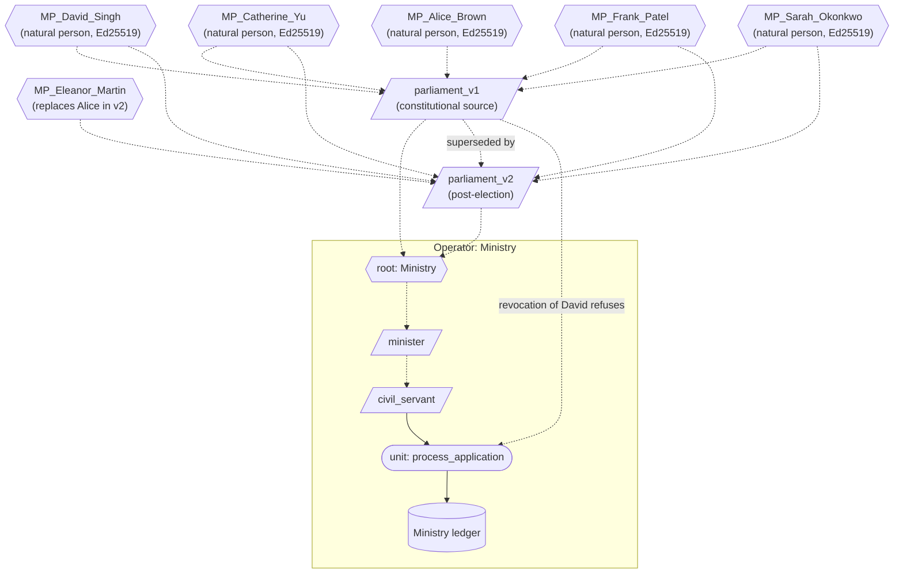

# Constitutional anchoring

A simulation of the substrate's authority chain terminating at natural-person credentials — the architectural mechanism the substrate uses to ground all authority in specific human beings. Closes the architectural loop on what was previously the substrate's most-discussed unfilled commitment.

## What this demonstrates

The substrate's central claim is that the authority chain terminates at the natural persons whose constitutional source credentials ground every authority. Throughout the other demonstrations, the constitutional source has been a string-labelled credential — `parliament_uk`, `crown`, `constitutional_authority` — with a randomly-generated Ed25519 keypair. The chain terminated at a label.

This demonstration shows the architectural mechanism that would terminate the recursion at natural persons. **Natural-person anchoring is the cooperative-substrate pattern applied at the root**: a constitutional source credential is a credential whose parent references are natural-person credentials. The substrate's existing machinery — credentials with parent refs, authority-chain walking, supersession, revocation — composes to give it. No new architectural mechanism is required.

Four substrate properties become concretely visible:

1. **Authority chains visibly terminating at named natural persons** rather than at string labels. Walking any unit's authority chain upward reaches specific named individuals (here, five MPs with their own Ed25519 keypairs).
2. **Election succession**: the constitutional source's membership changes; the new source is a different credential (different content_id) because its parent references differ; the old source is superseded; downstream compiled forms invalidate; recompilation under the new source restores operation.
3. **Mid-term revocation**: revoking one natural-person credential propagates through every compiled form whose authority chain includes it. The substrate refuses to operate under an incomplete constitutional source.
4. **Constitutional events on the ledger**: every supersession and revocation lands as an administrative act with the authorising credential recorded.

## What this is and what it isn't

This is the architectural mechanism that, if institutionally and cryptographically anchored to specific humans, would close the substrate's deepest commitment. It is not the institutional anchoring itself. The README is explicit about this distinction throughout, because conflating the two is the most common honest confusion about what the substrate claims.

**This DOES demonstrate**:

- The substrate's authority chain reaches named natural-person credentials by content_id.
- Election succession works structurally: parliament_v1 → parliament_v2 (different content_id, different parents), supersession recorded on the ledger, downstream invalidation, recompilation.
- Revocation of a single natural-person credential propagates through the substrate's invalidation surface to every dependent compiled form.
- Constitutional events are themselves substrate events, audit-visible on the operator's ledger.

**This does NOT demonstrate**:

- The institutional/legal/cryptographic apparatus that anchors a specific Ed25519 keypair to a specific human being. Biometric attestation, hardware security modules certified against natural persons, legal recognition of cryptographic credentials, processes for key generation, loss, recovery, death, transfer of office. All outside what code can verify.
- That real constitutional sources (parliaments, courts, treaty bodies) would adopt substrate-style anchoring. That is political work outside the substrate's domain.
- That the names in the demonstration (`MP_Alice_Brown`, etc.) correspond to actual humans. They are credential labels in a Python file.

## How the substrate is deployed

> Diagram conventions are listed in [docs/diagram_legend.md](../../docs/diagram_legend.md). This is the only example whose architectural interest is at the **top** of the diagram (named natural persons), not the middle (operator units).



> The unit's authority chain walks upward through `civil_servant` → `minister` → `Ministry root` → `parliament_v1` → five named natural persons. Election produces `parliament_v2` with a different content_id (Eleanor replaces Alice); `parliament_v1` is superseded; compiled forms under v1 invalidate; recompilation under v2 restores operation. Revoking David mid-term refuses every invocation whose authority chain reaches him until a fresh constitutional source is constituted.

A single operator (Ministry) running a trivial functional unit. The interesting structure is the credential graph:

```
parliament_v1 (constitutional source; content_id derived from member set)
    |
    +--> MP_Alice_Brown    [natural person credential, Ed25519 keypair]
    +--> MP_David_Singh    [natural person credential, Ed25519 keypair]
    +--> MP_Catherine_Yu   [natural person credential, Ed25519 keypair]
    +--> MP_Frank_Patel    [natural person credential, Ed25519 keypair]
    +--> MP_Sarah_Okonkwo  [natural person credential, Ed25519 keypair]
```

The unit's authority chain starts at parliament_v1 and walks upward to the five MPs. The substrate's compile-at-commit collects parliament_v1's transitive ancestry into the compiled form's authority_chain. The runtime's authority-chain check, on every invocation, verifies each of these credentials (including each natural-person credential).

## What the substrate provides — mapped to the natural-person commitment

| Substrate claim | Architectural mechanism | What this demonstration shows |
|---|---|---|
| Authority chains terminate at natural persons | Constitutional source credential has parent_refs to natural-person credentials | The walk visibly reaches MPs by name |
| Constitutional changes are auditable | Supersession is an administrative act on the ledger | Election from parliament_v1 to parliament_v2 recorded |
| Constitutional changes propagate | Supersession at any chain credential refuses invocations of compiled forms that depend on the superseded credential | Old compiled form refuses after supersession; recompilation under new source restores |
| Mid-term changes propagate | Revocation at any chain credential refuses invocations | David Singh's revocation refuses subsequent invocations until reconstituted |
| Constitutional events are non-suppressible | The ledger is hash-chained; administrative acts cannot be retroactively edited | Six-event ledger verifies end-to-end |

## Running it

```
python -m examples.constitutional_anchoring.run
```

## Reading the output

The demonstration walks through five sections:

1. **Setup** — five MPs, parliament_v1 quorum, derived ministerial and civil-servant credentials, process_application unit.
2. **Authority chain visibility** — walks the unit's authority chain upward, printing the tree. Visibly terminates at five named natural persons.
3. **Normal operation** — civil_servant_v1 invokes process_application_v1; permit; application processed.
4. **Election** — Alice Brown replaced by Eleanor Martin; parliament_v2 minted (different content_id); parliament_v1 superseded; old compiled form refuses; new chain reconstituted; new compiled form permits.
5. **Revocation** — David Singh resigns; his credential revoked; the substrate's authority-chain check refuses; reconstitution would require parliament_v3.

Plus a six-act ledger summary and the explicit "demonstrated vs not demonstrated" closing.

## What this closes architecturally

The substrate's claim that "the recursion terminates at the natural person" is now demonstrably the cooperative-substrate pattern applied at the root. The mechanism is the substrate's existing machinery; the demonstration shows it in action; the limits are institutional rather than architectural.

The substrate's verification programme is now complete against:

- Architectural correctness (159 tests pass)
- Five real failure cases (Horizon, Robodebt, Lavender, SolarWinds, CrowdStrike), each structurally distinct
- Constitutional anchoring (this demonstration)

What remains is engineering and adoption work, not architectural verification:

1. The institutional apparatus that anchors natural-person credentials to specific humans
2. Persistence, key management, distribution at scale
3. Paper revision to reflect what implementation surfaced
4. Pilot adoption with real operators

None of these is a question the substrate's code can answer.
