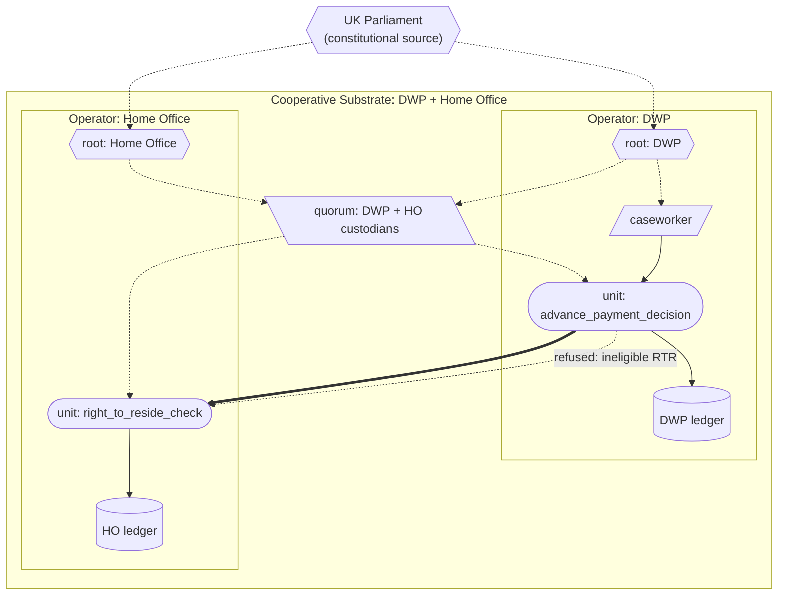

# Universal Credit (cross-operator)

The same Universal Credit advance payment decision as the single-operator example, but now decomposed across two operators (DWP and Home Office) composing under a cooperative substrate. Demonstrates that the substrate's machinery for cross-operator composition is the same machinery as for single-operator composition — there is no new architecture, only new wiring.

## What this demonstrates

- Two independent operators each running their own substrate, each retaining sovereignty over their own ledger and custodian.
- A **cooperative substrate** as a credential pattern (not a new primitive): a credential whose parent references span both operator roots. Units that reference this credential have both roots in their authority chains, which is what permits credentials from either operator to be delegated under the other's units.
- **Cross-operator invocation** through `runtime.invoke_in()` routing via the cooperative substrate's federation registry.
- **Joint witnessing**: cross-operator compiled forms are signed by both operators' Ed25519 custodians under a quorum custodian — neither operator can unilaterally produce a valid witness for a cooperative-substrate unit.
- **Delegation across operator boundaries**: a DWP-rooted caseworker credential is structurally delegated under a Home Office unit, because the cooperative substrate brings DWP's root into the Home Office unit's authority chain.
- **Ledger sovereignty**: each operator owns its own ledger; the joint audit trail is the union of the two ledgers, joinable on cross-operator act_id references carried in act outputs.

This is the architectural test of compositional uniformity: if the substrate's central claim ("the same primitives at every scale") is right, cross-operator should require no new mechanisms. It does not. The same `compile_unit()`, the same `Runtime.invoke()`, the same `Permit`/`Refuse`/`Act` types operate across operator boundaries.

## The case

Real UK welfare decisions often touch multiple authorities. A Universal Credit applicant's right to claim depends on their right-to-reside status, which is held by the Home Office. Currently this is coordinated through bilateral data-sharing arrangements, system integrations, and political agreements. The substrate's question is: what would it look like for these arrangements to be substrate primitives — content-addressed, jointly witnessed, refusable, audit-traceable across operator boundaries?

In this demonstration:

- **DWP** holds welfare authority. The `advance_payment_decision` unit lives here.
- **Home Office** holds identity / right-to-reside authority. The `right_to_reside_check` unit lives here.
- A **cooperative substrate credential** has been jointly committed by both. Each operator references it in their cross-operator units' credential_refs.

## How the substrate is deployed

> Diagram conventions are listed in [docs/diagram_legend.md](../../docs/diagram_legend.md).



> The dashed arrow shows the cross-operator refusal pattern: when Home Office's `right_to_reside_check` refuses, the DWP-side `advance_payment_decision` records "refer to human" on the DWP ledger, citing the Home Office act_id. A revoked DWP caseworker is refused before the cross-operator call is ever made.

**Operators**: DWP and Home Office. Each is a separate `Operator` instance with its own runtime, ledger, and custodian. (Phase 2-deepened simplification: both share archives in-process; a real distributed deployment would have per-operator archives plus a content-exchange protocol.)

**Authority chain**:

```
UK Parliament (constitutional source)
    |
    +--> DWP root (operator identity)
    |       \--> DWP caseworker
    |
    +--> Home Office root (operator identity)
    |
    +--> Cooperative substrate credential
         (parent credential_refs: [DWP root, Home Office root])
```

**Units**:

- `advance_payment_decision` (DWP-side): the composing unit. Its impl invokes Home Office's `right_to_reside_check` via `runtime.invoke_in()`.
- `right_to_reside_check` (Home Office-side): performs the RTR check. References the cooperative substrate in its credential_refs so DWP credentials are delegated under it.

**Compilation**: cross-operator units are compiled under the cooperative substrate's quorum custodian (a `QuorumCustodian` over both operators' `LocalCustodian`s). Their compiled-form witnesses are multi-signatures verifiable independently by any party with both operators' public keys.

## What the substrate provides

- **Delegation crosses operator boundaries by construction**, not by ad-hoc convention. The cooperative substrate brings both operator roots into cross-operator units' authority chains; the runtime's standard delegation check (which has not changed) handles the cross-operator case automatically.
- **Both operators record their own ledger entries**. DWP's act records what DWP did (invoke `advance_payment_decision`, get the result). Home Office's act records what Home Office did (perform RTR check, return the verdict). The joint audit trail is reconstructable by walking both — operators retain sovereignty over their records.
- **Refusal propagates cleanly across operator boundaries**. If Home Office's RTR refuses, the DWP act records "refer to human, citing HO act_id X." A regulator following the audit trail can follow the cross-operator reference.
- **Joint witnessing means neither side can unilaterally rewrite cross-operator compiled forms**. The cooperative substrate is, structurally, the formal arrangement.

## Running it

```
python -m examples.cross_operator_uc.run
```

## Reading the output

The output shows:

1. **Cooperative substrate**: identity (the cooperative credential's content_id) and members (both operators).
2. **Compiled forms** for `advance_payment_decision` (on DWP) and `right_to_reside_check` (on Home Office). Each has 4 credentials in its authority chain (Parliament, DWP root, Home Office root, cooperative substrate); each is witnessed under the joint quorum custodian.
3. **Three cases**:
   - UK applicant → DWP invokes HO via cross-operator → HO permits → DWP approves.
   - EU applicant → HO refuses → DWP refers to human, citing HO act_id.
   - Revoked DWP caseworker → DWP refuses *before* the cross-operator call; HO is never invoked.
4. **Both ledgers** print separately. DWP has 3 acts; HO has 2 acts. The joint audit trail is reconstructed by matching cross-operator act_id references.
