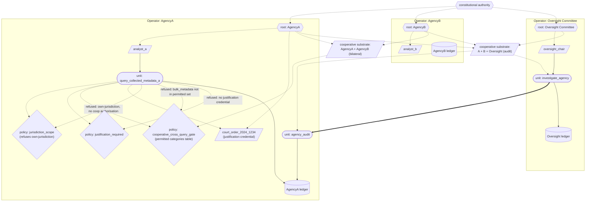

# Five Eyes / mass surveillance

A stylised model of cross-jurisdictional signals-intelligence mass surveillance against the substrate's commitments. Informed by the 2013 Snowden disclosures (PRISM, XKeyscore, Tempora, the bilateral Five Eyes query-exchange arrangements) but not a reconstruction of any specific real system. We do not have authoritative information about any current intelligence agency's internal architecture; the public record describes outcomes and structural arrangements.

This is the substrate's most ambitious falsification test, by some distance. It is also the one most starkly bounded by what code cannot do: the substrate cannot prevent governments from doing what they choose to do; it cannot prevent constitutional sources from being captured; it cannot force oversight bodies to look. What it CAN demonstrate is the architectural mechanism that would make systemic surveillance structurally legible to its constitutional sources — turning the question from "are the authorising bodies being deceived about scope?" into "are the authorising bodies looking at the ledger?".

## What this demonstrates

- **Scope visibility through the ledger**: every collection / query act is a ledger event with declared target, target jurisdiction, requesting agency, justification credential, and verdict. Oversight authorities query the agency's ledger via cooperative-substrate audit; the scope of what is being done is no longer something they have to trust the agency to report honestly.
- **Cross-jurisdictional circumvention refused by default**: domestic restrictions on agencies querying their own citizens are structural; the substrate refuses such queries unless a cooperative-substrate authorisation explicitly permits the specific query category. The cooperative substrate's permitted query categories are themselves credentialed; substituting more permissive policies is a substrate event recorded on multiple ledgers.
- **Authority chain visibility**: every query records the analyst credential, the justification credential (specific court order, warrant, parliamentary authorisation), and (where applicable) the cooperative authorisation credential. There is no anonymous query.
- **Structural oversight replaces whistleblowing**: oversight authorities are cross-operator audit operators; they have structurally-committed audit rights. Auditing the surveillance machinery does not require removing classified documents and giving them to journalists; it requires the oversight body invoking its audit unit.

## The case

In June 2013, Edward Snowden began disclosing documents from his work at NSA contractor Booz Allen Hamilton. The disclosures, published primarily through The Guardian and The Washington Post, documented:

- **PRISM** (US): bulk collection from major US tech companies (Google, Microsoft, Facebook, Apple, Yahoo, AOL, others) under FISA Section 702.
- **XKeyscore** (US-led, multi-jurisdictional): a search interface across collected data including emails, browsing history, search history, with relatively unrestricted analyst access.
- **Tempora** (UK): GCHQ bulk interception of fibre-optic cable traffic.
- **Bilateral query-exchange arrangements** among the Five Eyes (US, UK, Canada, Australia, New Zealand): each agency's legal prohibition on spying on its own citizens was effectively circumvented by partner agencies querying the holdings on those citizens on each other's behalf.

The structural failure points the substrate is relevant to:

1. **Scope invisibility**: the programmes' actual scope was not visible to the constitutional authorities (US Congress, UK Parliament, FISA Court) that nominally oversaw them. Authorising orders covered broad categories; downstream query-level acts were not meaningfully auditable.
2. **Cross-jurisdictional circumvention**: each agency's domestic-spying prohibitions were structurally bypassed by the bilateral arrangements. The substrate of the arrangement was opaque to the constitutional authorities that had imposed the prohibitions.
3. **Authority chain opacity**: which credentials authorised specific queries was not visible to oversight in any meaningful way.
4. **No structural policies on collection scope**: collection was governed by classified policies; whether a specific query exceeded its authorising policy was not structurally checkable.
5. **Whistleblowing as the only detection path**: the programmes' scope became known because of Snowden, not because of any structural oversight mechanism.

## How the substrate is deployed

> Diagram conventions are listed in [docs/diagram_legend.md](../../docs/diagram_legend.md). This case has two overlapping cooperative substrates, so each is drawn as a credential node rather than an enclosing boundary.



> Every query must satisfy three bindings: the justification policy (must declare a specific court order or warrant credential), the jurisdiction-scope policy (refuses an agency querying its own jurisdiction without bilateral cooperative authorisation), and the cooperative-substrate gate (permitted-categories table; `counter_terrorism_subjects` is in the set, `bulk_metadata` is not). The Oversight Committee invokes `agency_audit` cross-operator; the forensic report lands on the Oversight ledger with every permitted and refused query fully attributed.

Three operators federated under two cooperative substrates:

| Operator | Role |
|---|---|
| `AgencyA` | signals-intelligence agency in jurisdiction A |
| `AgencyB` | signals-intelligence agency in jurisdiction B |
| `OversightCommittee` | independent parliamentary oversight; cross-operator audit |

**Two cooperative substrates**:

- **AgencyA + AgencyB** (bilateral): cross-jurisdictional query exchange. The cooperative substrate's authority covers cross-jurisdictional queries, with a credentialed permitted-categories table.
- **AgencyA + AgencyB + OversightCommittee** (oversight): audit rights. The cooperative substrate's authority covers cross-operator audit invocations.

**Authority chain**:

```
constitutional authority
    |
    +--> AgencyA root
    |       \--> analyst_a
    +--> AgencyB root
    |       \--> analyst_b
    +--> OversightCommittee root
    |       \--> oversight_chair
    +--> court_order_2024_1234 (justification credential)
    +--> court_order_2024_1235 (justification credential)
    |
    +--> cooperative_substrate_bilateral_agencies
    +--> cooperative_substrate_oversight
```

**Units**:

- `query_collected_metadata_a` (AgencyA): the query unit. References `jurisdiction_scope_policy` and `justification_required_policy`. Refuses queries that violate either.
- `jurisdiction_scope_policy` (FAA-side governance): refuses queries where the target's jurisdiction matches the executing agency's WITHOUT cooperative authorisation.
- `justification_required_policy`: refuses queries with no justification credential declared.
- `cooperative_cross_query_gate` (cooperative-substrate authorised): the cross-jurisdictional gate. Permits queries only for (requesting, target, category) tuples in the cooperative substrate's permitted table.
- `agency_audit` / `investigate_agency`: cross-operator audit pair.

## What the substrate provides — mapped to each failure point

| Five Eyes failure | Substrate property |
|---|---|
| 1. Scope invisibility | **Scope visibility through the ledger**. Every query is a ledger event with all relevant fields declared. Oversight invokes cross-operator audit; the scope is structurally visible. |
| 2. Cross-jurisdictional circumvention | **Cooperative-substrate permitted-categories table**. AgencyA cannot query AgencyA's jurisdiction without cooperative authorisation; categories like `bulk_metadata` are not in the permitted set; expanding the set requires substrate events visible to OversightCommittee. |
| 3. Authority chain opacity | **Structural authority chain**. Every query records the analyst, the justification, and the cooperative authorisation as credentials. The substrate's authority-chain walk surfaces them all. |
| 4. No structural policies on collection scope | **Policy units with content_ids**. The permitted-categories policy is a functional unit; its content_id is the authorisation; substituting a more permissive policy is a new content_id, visible in any audit. |
| 5. Whistleblowing as only detection path | **Cross-operator audit by oversight**. OversightCommittee has structurally-committed audit rights; auditing is invoking a unit, not removing documents. |

What the substrate **cannot** prevent:

- A constitutional source choosing to deploy more permissive policies. The substrate makes the choice visible; it cannot make the choice.
- Oversight bodies choosing not to invoke their audit rights, or being structurally denied the credentials needed to do so. The substrate provides the structural place for oversight; it cannot force oversight to look.
- The fundamental political question of whether mass-collection capabilities should exist at all. The substrate makes the capabilities and their use structurally legible; what to do about them is downstream of the architecture.

The substrate's claim against Five Eyes is therefore **conditional and bounded**. The architectural mechanism turns the question from "are the constitutional authorities being deceived about scope?" into "are the constitutional authorities looking at the ledger?". The second question is a political question. The first becomes structurally unanswerable in the affirmative.

## Running it

```
python -m examples.five_eyes.run
```

## Reading the output

The demonstration walks through:

1. **Setup** — three operators, two cooperative substrates, two policies, cross-jurisdictional gate.
2. **Query 1** — AgencyA analyst queries AgencyA's data on own-jurisdiction subject, no cooperative authorisation. **Refused** by `jurisdiction_scope_policy`.
3. **Query 2** — same as 1, but analyst attempts to obtain cooperative authorisation first. The cooperative gate refuses (self-jurisdiction queries are not in the bilateral cooperative substrate's permitted set). **Refused at the gate, then refused by the policy.**
4. **Query 3** — cross-jurisdictional: AgencyA queries AgencyB's data under category `counter_terrorism_subjects`. The cross-gate permits (this category IS in the permitted set). **Authorised at the gate.**
5. **Query 4** — same as 3, but category `bulk_metadata`. **Refused at the gate** — not in permitted set.
6. **Query 5** — query with no justification credential. **Refused** by `justification_required_policy`.
7. **Oversight investigation** — OversightCommittee cross-operator audits AgencyA. Forensic report on Oversight's own ledger shows every permitted and refused query with full attribution.

## What this verifies and what it does not

**Verifies**: the substrate's architectural commitments — cooperative-substrate cross-jurisdictional gating, ledger-based scope visibility, structural policies on query categories, cross-operator independent audit, refusal as first-class output with full attribution — operate against systemic mass-surveillance arrangements the same way they operate against any other cross-operator scenario. Compositional uniformity holds in a domain that is structurally adversarial to the substrate's commitments.

**Does not verify**:

- That intelligence agencies would adopt substrate-style structural oversight. They have substantial institutional and operational reasons not to.
- That oversight bodies would invoke their audit rights if they had them. The history of intelligence oversight is largely one of bodies not exercising the powers they nominally have.
- That cooperative-substrate arrangements between sovereign-state intelligence agencies are politically achievable. These are negotiated as classified bilateral / multilateral arrangements with no public accountability.
- That public reporting on Five Eyes accurately characterises the actual arrangements. The demonstration uses synthetic stylised scenarios; it is not a claim about what any specific real agency does.

The substrate's contribution here is structural: it makes the cross-jurisdictional surveillance arrangements that exist substrate-legible. Whether they are made substrate-legible is the political question the architecture cannot answer. What the architecture says is: if you want oversight, this is what oversight would look like, and the substrate's machinery would carry it. The choice to want oversight, and to exercise it, is downstream of every code path the substrate provides.

This is the substrate's most architecturally ambitious test and its most politically bounded. Both qualifications matter; the substrate is verified against the architectural commitments and is honest about the political ones.
