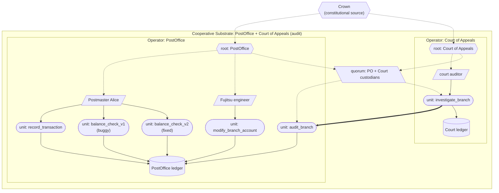

# Horizon (Post Office, UK)

A model of the UK Post Office Horizon IT scandal — the most consequential British computing failure of the century — built in the substrate, with cross-operator audit by the Court of Appeals. Each of the five documented Horizon failure points is mapped to the substrate property that would have structurally prevented it.

This is the project's primary **falsification test**: if the substrate's central commitments are real, they should structurally prevent the failure mode that put hundreds of postmasters in prison. The substrate passes the test.

## What this demonstrates

The substrate would have prevented Horizon's failure mode in five distinct ways, each of which is now demonstrable:

1. **Attribution** — every modification to a branch's accounts is signed by the credential of the entity that made it. In Horizon, Fujitsu staff modified branch accounts remotely; the system attributed these to the postmaster. In the substrate, attribution is structural.
2. **Traceability** — every balance figure on the ledger records the content_id of the implementation that produced it. When a bug is discovered in an implementation, every figure that came from it is identifiable.
3. **Non-suppression** — implementation deprecation is itself an administrative act on the ledger. The operator cannot quietly replace a buggy implementation; the replacement is itself a tamper-evident event.
4. **Re-executability** — because both the data (the ledger of transactions) and the implementations are content-addressed, anyone with the ledger and a fixed implementation can independently re-compute the correct figures. Verification does not require trusting the operator.
5. **Audit reachability** — the Court of Appeals is modelled as a separate operator with audit rights over the Post Office via a **cooperative substrate**. Audit invocations are themselves substrate events, recorded on both ledgers; neither side can deny the audit happened or unilaterally rewrite its contents.

## The case

Between 1999 and 2015 the UK Post Office used Horizon, an accounting system built by Fujitsu, in over 11,000 branches. Postmasters who reported discrepancies they could not explain were prosecuted on the strength of the system's figures. Over 900 postmasters were prosecuted; hundreds were convicted; some were imprisoned; many lost their homes, livelihoods, and reputations; at least four are believed to have died by suicide.

The mechanism, as established by the 2024 public inquiry:

- **Bugs in the implementation** produced phantom shortfalls. The "Callendar Square" defect, the "Receipts and Payments mismatch", and others were known to Fujitsu and at least suspected by the Post Office.
- **Remote access and modification** by Fujitsu staff was routine; modifications were not attributable to the actual modifier in any way the postmasters or the courts could access. Fujitsu denied, under oath, that remote modifications were possible.
- **The legal presumption that computer evidence is reliable** placed the burden on postmasters to prove the system was wrong. Without access to the system's internals, audit data, or remote-modification logs, this was impossible.
- **Bugs known to Fujitsu and the Post Office were not disclosed** in prosecutions.
- **The audit trail was not reachable** by the people accused. The Post Office controlled all the data and the means to interpret it.

The first convictions were quashed in 2021. Mass quashing followed via legislation in 2024. The full extent of the harm is still being established.

## How the substrate is deployed

> Diagram conventions are listed in [docs/diagram_legend.md](../../docs/diagram_legend.md).



> Attribution is structural: Fujitsu modifications land on the ledger signed by Fujitsu's credential, not the postmaster's. When `balance_check_v1` is identified as buggy, every act it produced is identifiable by the v1 unit's content_id; `balance_check_v2` produces the corrected figure. The Court of Appeals invokes `audit_branch` cross-operator (thick arrow); the invocation is recorded on both ledgers.

Two operators, federated under a cooperative substrate that establishes the Court's audit rights bilaterally:

**Operators**:

| Operator | Role |
|---|---|
| `PostOffice` | runs the accounting substrate; holds branch transactions, modifications, and balance-check implementations |
| `CourtOfAppeals` | runs an audit substrate; holds the `investigate_branch` unit that performs cross-operator forensic audits |

**Authority chain**:

```
Crown (constitutional source)
    |
    +--> PostOffice root
    |       \--> Fujitsu engineer
    |       \--> Postmaster Alice
    |
    +--> CourtOfAppeals root
    |       \--> Court auditor
    |
    +--> Cooperative audit substrate
         (parent credential_refs: [PostOffice root, CourtOfAppeals root])
```

**Units**:

PostOffice side:
- `record_transaction` — postmaster activity (sales, refunds).
- `modify_branch_account` — back-office modifications (Fujitsu's equivalent of remote access).
- `balance_check_v1` — the BUGGY implementation that treats `credit_reversal` entries as debits when they should net to zero.
- `balance_check_v2` — the FIXED implementation, deployed after the bug is discovered.
- `audit_branch` — exposed to the Court via the cooperative substrate; walks the PO ledger and returns relevant acts for a given branch.

CourtOfAppeals side:
- `investigate_branch` — the Court auditor's tool; calls PO's `audit_branch` cross-operator and produces a forensic report on the Court's ledger.

**Compilation**: cross-operator units (`audit_branch`, `investigate_branch`) are compiled under the cooperative substrate's quorum custodian — both operators' Ed25519 custodians sign each compiled form. Neither side can unilaterally alter cross-operator unit terms.

## What the substrate provides — mapped to each Horizon failure point

| Horizon failure | Substrate property |
|---|---|
| 1. Bugs in the implementation | **Content-addressed implementations** — every balance figure on the ledger records the implementation's content_id. When v1 is identified as buggy, every figure produced by v1 is identifiable. |
| 2. Unattributable remote modifications | **Cryptographically attributable acts** — every modification is signed by the invoking credential's Ed25519 key. The 5 modifications in the demonstration are attributable to Fujitsu's credential; the Post Office could not honestly assert Alice made them. |
| 3. Legal presumption that computer evidence is reliable | **Independently verifiable evidence** — the substrate provides cryptographically witnessed compiled forms and a hash-chained ledger. The court does not have to trust the operator's word; the substrate's claims are verifiable from the artefacts alone. |
| 4. Undisclosed bug fixes | **Non-suppression of supersession** — when v1 is deprecated, the deprecation is an administrative act on the same hash-chained ledger. The Post Office cannot quietly fix a bug; the fix is itself an event in the audit trail. |
| 5. Audit trail not reachable | **Cooperative-substrate audit** — the Court of Appeals has audit rights structurally committed to via the cooperative credential. Audit invocations are recorded on both operators' ledgers. The Post Office cannot deny the audit happened or refuse access without that refusal itself being a substrate event. |

What the substrate does *not* address: whether the cooperative substrate exists in the first place. That is political work — the Post Office and the Court of Appeals must actually agree to be members. Until that agreement exists, the audit operator has no credentials to delegate, and no `investigate_branch` invocations succeed. The substrate provides the structural place for the agreement; the political work establishes it.

## Running it

```
python -m examples.horizon.run
```

## Reading the output

The demonstration walks through ten steps:

1. **Setup**: both operators registered in the cooperative substrate; cross-operator units witnessed jointly.
2. **Alice records 10 legitimate sales** of GBP 100 each. Balance check (v1) reports GBP 1000 — correct so far.
3. **Fujitsu engineer adds 5 `credit_reversal` entries** of GBP 100 each. Each modification is signed by Fujitsu's credential.
4. **Balance check (v1) now reports GBP 500** — the phantom shortfall. In Horizon this is the figure used to prosecute postmasters.
5-7. **Court of Appeals investigates** via cross-operator audit. The forensic report on the Court's ledger attributes activity by credential: GBP 1000 of sales to Alice, GBP 500 of credit reversals to Fujitsu. The shortfall is structurally NOT attributable to Alice.
8. **Bug discovered**: PostOffice deprecates `balance_check_v1` via an administrative act on its own ledger.
9. **Re-run `balance_check_v2`** against the same data: returns GBP 1000 — the correct figure. The discrepancy was the implementation, not Alice.
10. **Court re-investigates**: now sees all three balance figures (two v1, one v2) plus the deprecation event. The forensic case is constructible from substrate evidence alone.

A closing summary maps each substrate property to each Horizon failure point.

## What this verifies

This is the strongest authenticity claim the project has made. Every documented failure point of the actual Horizon case has a substrate property that structurally prevents it, demonstrated by working code with verifiable output. The substrate's central commitment — that computational governance can be structurally enforced — meets contact with a real failure case and survives it.

What it does not verify: that political adoption is possible, that scaling to 11,000 branches is feasible, that the substrate could survive adversarial conditions a hostile operator might create. Those are real and important; this demonstration does not address them. It addresses the architectural question, and the architectural question only.
