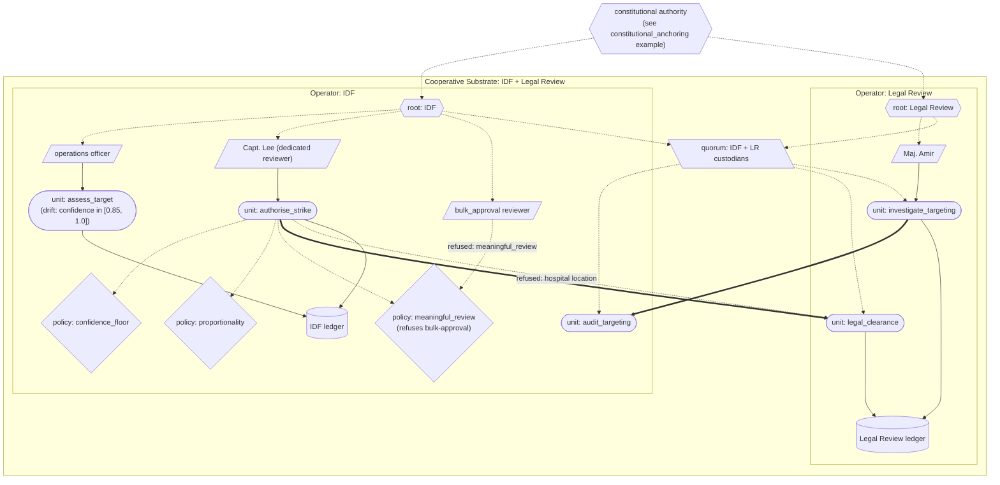

# Algorithmic targeting (Lavender)

A stylised model of algorithmic target selection in war against the substrate's architectural commitments. Informed by reporting on the Lavender system used by the Israeli military in Gaza in 2023-2024 (notably +972 Magazine and Local Call, April 2024), but not a reconstruction of any specific operational system: we do not have authoritative information about Lavender's internal architecture; the public reporting describes outcomes and operational practices.

This is the substrate's **most ambitious falsification test and the one that most directly stresses its largest unfilled architectural commitment**: natural-person anchoring of the constitutional source. The substrate demonstrates several structural properties that would address documented failure modes; it cannot itself close the natural-person gap, and that gap is decisive for any real military application. The README is explicit about this.

## What this demonstrates

What the substrate's architectural commitments would demand of any algorithmic system used for such decisions. Five reported failure modes from the public record are mapped to substrate commitments:

1. **Behaviour-characterised system with insufficient calibration commitments acted on at runtime** → `assess_target` declares a `confidence` section in its spec (produces=True, calibration claim, acceptance_band) AND drift criteria; the substrate enforces both per-invocation calibration via `confidence_gate` on the `confidence_floor_policy` (threshold is part of the policy's content_id) and systematic drift over a window.
2. **Human review reduced to nominal approval (~20 seconds per target)** → a meaningful-review policy refuses bulk-approval credentials; reviewer attribution is itself ledger-visible and patterns of misuse are detectable.
3. **Pre-authorised collateral damage thresholds** → per-invocation policy evaluation; the policy unit's content_id is the threshold; deploying more permissive thresholds requires substituting a new policy unit, visible in any audit.
4. **Drift in classifier accuracy not detected or acted on** → drift criteria in the spec; runtime monitor enforces; once drifted, the unit refuses until reset by an authorised operator action (itself a ledger event).
5. **Independent legal review absent or structurally limited** → cooperative-substrate audit by a legal-review operator (JAG, ICRC, court of jurisdiction) with bilaterally-committed clearance and audit rights; audit invocations are recorded on both ledgers. `legal_clearance` produces its own clearance-margin confidence; `authorise_strike` declares `propagation: "minimum"` and the runtime propagates the minimum sub-unit confidence into the strike output.

## The case

In April 2024, +972 Magazine and Local Call published reporting on Lavender, an AI system reportedly used by the Israeli military to identify human targets for airstrikes during the Gaza war. The reporting (drawn from interviews with intelligence officers) described:

- An AI model assigning scores to people based on features intended to identify likely Hamas militants.
- An estimated ~10% error rate in the classifier's identifications.
- Human reviewers approving strikes; reported review time per target was approximately 20 seconds.
- Pre-authorised collateral damage thresholds: e.g., for low-ranking militants, permitting estimated civilian casualties of 15-20 per strike.
- A separate system ("Daddy's Home" / "Where's Daddy?") that tracked when targets returned home, triggering strikes during family time — increasing the civilian casualty figure.

These are the documented failure modes the public reporting described. They are not claims about specific incidents this demonstration models; the demonstration uses **synthetic stylised targets** that exhibit the failure-mode patterns rather than modelling any real targets, persons, or operations.

## How the substrate is deployed

> Diagram conventions are listed in [docs/diagram_legend.md](../../docs/diagram_legend.md).



> The five stylised target cases each exercise one binding: confidence_floor refuses target_002 (low confidence); proportionality refuses target_003 (40 civilians); meaningful_review refuses target_004 (bulk-approval reviewer); legal_clearance refuses target_005 (protected site) cross-operator. After 5 low-confidence assessments the drift criterion on `assess_target` fires; the unit is invalidated until reset.

Two operators federated under a cooperative substrate:

**Operators**:

| Operator | Role |
|---|---|
| `IDF` | runs the targeting substrate; holds `assess_target` (behaviour-characterised classifier), `authorise_strike` (composing unit), and the policies that gate authorisation |
| `LegalReview` | independent legal-review operator (stand-in for JAG / IHL / ICRC); holds `legal_clearance` (cross-operator gate) and `investigate_targeting` (cross-operator forensic audit) |

**Authority chain**:

```
constitutional_authority (string-labelled; the natural-person anchoring gap)
    |
    +--> IDF root
    |       \--> Operations officer
    |       \--> Capt. Lee (dedicated reviewer)
    |       \--> bulk_approval reviewer (rubber-stamp marker)
    |
    +--> Legal Review root
    |       \--> Maj. Amir (legal officer)
    |
    +--> Cooperative substrate (IDF + Legal Review)
         (parent credential_refs: [IDF root, Legal Review root])
```

**Units**:

- `assess_target` (IDF, behaviour-characterised) — produces (score, confidence, civilian_estimate, military_value, target_category, location_class). Declares drift criteria: mean confidence over last 5 invocations must stay in [0.85, 1.0].
- `confidence_floor_policy`, `proportionality_policy`, `meaningful_review_policy` (IDF, policy units) — gate authorise_strike at invocation time.
- `authorise_strike` (IDF, composing) — references all three policies via binding credentials; its impl calls `legal_clearance` cross-operator. Returns `strike_authorised` only if all policies permit AND legal clearance permits.
- `legal_clearance` (Legal Review) — refuses for protected sites (hospitals, schools, places of worship) and applies its own stricter proportionality check.
- `audit_targeting` (IDF) / `investigate_targeting` (Legal Review) — cross-operator audit pattern.

**Stylised target cases**:

| Target | Description | Expected outcome |
|---|---|---|
| `target_001` | high-value commander, isolated compound, low civilians, dedicated reviewer | strike authorised |
| `target_002` | mid-ranking, confidence 0.62, low civilians | `confidence_floor_policy` refuses |
| `target_003` | high-value commander, dense residential, civilians=40 | `proportionality_policy` refuses |
| `target_004` | high-value, mid-ranking, dedicated other params but reviewer is bulk-approval marker | `meaningful_review_policy` refuses |
| `target_005` | high-value, dedicated reviewer, but location is a hospital | `legal_clearance` refuses cross-operator |

## What the substrate provides — mapped to each failure mode

| Failure mode | Substrate property |
|---|---|
| 1. Behaviour-characterised classifier acted on without enforcing calibration | **Drift detection on `assess_target`**. Mean confidence over a sliding window must stay in [0.85, 1.0]. After 5 low-confidence assessments, the unit is marked drifted; subsequent invocations refuse with a rationale naming the criterion and the evidence. |
| 2. Nominal human review (~20s per target) | **`meaningful_review_policy`**. Refuses bulk-approval credentials. The reviewer's act is itself a ledger event; patterns of misuse (one reviewer credential approving thousands of strikes in minutes) are structurally detectable. |
| 3. Pre-authorised collateral damage thresholds | **`proportionality_policy`**. Per-invocation. The policy unit's content_id is the threshold; substituting a more permissive policy requires a new content_id, visible in any audit. |
| 4. Drift not detected or acted on | **Drift detection sticky**. Once drifted, the unit refuses until reset by an authorised operator action (administrative act on the ledger, attributable to a specific authorising credential). |
| 5. Independent legal review structurally limited | **Cooperative-substrate cross-operator legal clearance**. `authorise_strike` cannot return "authorised" without invoking `legal_clearance` on the Legal Review operator. The invocation is recorded on both ledgers; refusal propagates back to the IDF unit as a refer-to-human decision. |

## What the substrate does NOT address — and why this matters most here

**Institutional natural-person anchoring**. The substrate's architectural mechanism for terminating the authority chain at natural persons is demonstrated separately in `examples/constitutional_anchoring/` — a constitutional source credential is a credential whose parent_refs are natural-person credentials, each with their own real Ed25519 keypair. The substrate's existing primitives compose to give the mechanism without new architecture.

In THIS demonstration, the constitutional source is a string-labelled credential with a random Ed25519 keypair, because duplicating the natural-person setup in every example would add bloat without architectural value. The architectural mechanism is shown in the constitutional_anchoring example; this example demonstrates the targeting-specific commitments separately.

For any real military application, what is decisive is the **institutional anchoring** of natural-person credentials to specific humans: biometric attestation, hardware security modules certified against natural persons, legal recognition of cryptographic credentials, processes for key generation, loss, recovery, death, and succession. All outside what the substrate's code can verify. The substrate provides the structural machinery; the institutional apparatus that anchors specific keypairs to specific humans is what makes "this strike was authorised by Maj. Amir" operationally — not just structurally — meaningful.

A welfare authority that misuses the substrate produces wrong debts; a military that misuses it produces wrong deaths. The standard for institutional anchoring is correspondingly higher in the military case. The architectural mechanism is the same; the apparatus that makes it real is what differs.

**Adoption**. The substrate's properties take effect only when an operator chooses to deploy the constraints honestly. The substrate makes the absence visible — every audit can see whether policies were attached, whether they were checked, whether drift criteria were declared — but it cannot prevent an operator under operational pressure from deploying a unit without the constraints. What the substrate adds is *structural visibility of the choice*. Whether visibility produces accountability is downstream of the architecture.

## Running it

```
python -m examples.lavender.run
```

## Reading the output

The demonstration walks through:

1. **Setup** — two operators, cooperative substrate, three policies on `authorise_strike`, cross-operator legal clearance required.
2. **Five target cases** (target_001 through target_005), each showing the substrate property at work or the failure mode being addressed.
3. **Drift demonstration** — five low-confidence assessments push `assess_target` out of calibration; subsequent assessments refuse.
4. **Cross-operator legal audit** — Legal Review investigates three targets; forensic reports on Legal Review's own ledger; audit invocations on the IDF ledger.
5. **Ledger integrity** — both ledgers hash-verify.
6. **Closing summary** — substrate properties mapped to failure modes, followed by an explicit statement of the natural-person anchoring limit and the adoption limit.

## What this verifies and what it does not

**Verifies**: the substrate's architectural commitments — behaviour-characterised contracts with calibration, drift detection, per-invocation policy evaluation, refuse-wins composition, refer-to-human as structural output, cross-operator legal clearance, cross-operator audit — operate against an algorithmic-targeting scenario in the same way they operate against welfare or postal-accounting scenarios. Compositional uniformity holds.

**Does not verify**:

- That the institutional natural-person anchoring is real. The architectural mechanism is shown in `examples/constitutional_anchoring/`; the institutional/legal/cryptographic apparatus that anchors specific keypairs to specific humans is outside what code can verify, and is most consequential in this application.
- That an operator would deploy these constraints honestly under political or military pressure. The substrate makes the choice visible; it cannot make the choice.
- That public reporting on Lavender accurately characterises the actual system. The demonstration uses synthetic stylised cases; it is not a claim about what any specific real system did or did not do.

The substrate's claim against algorithmic targeting in war is therefore conditional. **If** an operator deploys the constraints honestly, **and if** the institutional natural-person anchoring is real, the substrate addresses the documented failure modes structurally. The architectural mechanism for the second condition is in place (see constitutional_anchoring); the institutional apparatus that anchors specific keypairs to specific humans is what completes it.
