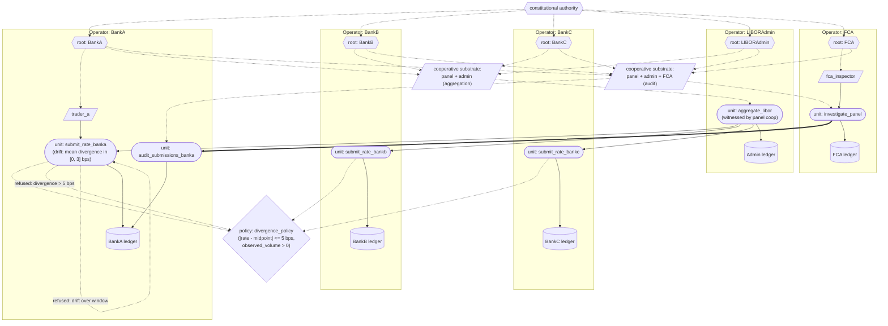

# LIBOR (interbank rate manipulation)

A model of the LIBOR (London Interbank Offered Rate) manipulation scandal of 2005-2012, built in the substrate. The substrate's unique contribution against this case is **cooperative-substrate aggregation across panel banks**: the benchmark is produced under a quorum custodian that includes every panel bank plus the administrator. Combined with content-addressed per-submission ledger events, a point-in-time divergence policy, and drift detection over a window, the substrate makes the structural choice ("did the bank submit honestly?") legible to a regulator audit operator.

## What this demonstrates

- **Content-addressed submissions**: every submission is a ledger event on the submitting bank's substrate, signed by the trader credential, carrying declared money-market activity context (observed volume, observed rate range) for the relevant window.
- **Confidence-as-architectural-property**: each panel bank's `submit_rate` declares a `confidence` section in its spec (produces=True, calibration claim — 1.0 at zero divergence, drops to 0 at the policy threshold). The aggregator declares `propagation: "mean"` and the benchmark output carries an aggregate confidence reflecting the mean of submission confidences. Even when individual submissions pass the per-submission policy, low confidences are structurally legible.
- **Cooperative-substrate aggregation**: the `aggregate_libor` unit is witnessed under a cooperative custodian spanning all panel banks plus the administrator. No single party can produce a valid benchmark unilaterally.
- **Point-in-time divergence policy**: submissions whose rate diverges from the implied midpoint of declared activity by more than a threshold are refused at submission time.
- **Drift detection on systematic divergence**: even when individual submissions pass the per-submission policy, systematic bias over a window trips drift on the behaviour-characterised contract.
- **Cross-operator regulator audit**: the FCA, as an audit operator under a regulator cooperative substrate, can invoke `audit_submissions` on any panel bank. The forensic report lands on the FCA's ledger.

## The case

Between 2005 and 2012, traders at multiple panel banks colluded to submit LIBOR rates that did not reflect their actual interbank borrowing costs. Two distinct manipulations occurred:

- During normal market conditions, traders submitted rates to profit their banks' derivatives positions, requesting submitters to push the rate up or down on specific days.
- During the 2007-2008 financial crisis, banks submitted artificially low rates to disguise funding stress and appear healthier than they actually were.

The British Bankers' Association (BBA), then administrator of LIBOR, collected daily submissions from 16-18 panel banks for each currency and maturity. The "trim and average" methodology (discard the top and bottom quartiles, average the middle) was supposed to be robust to individual manipulation. It failed because the manipulation was systemic.

Total fines (2012-2015) exceeded USD 9 billion across Barclays, UBS, RBS, Deutsche Bank, Rabobank, Lloyds, Bank of America, JP Morgan, Citigroup, and others. Tom Hayes (UBS / Citigroup trader) was convicted in 2015 on eight counts of conspiracy to defraud. LIBOR has been phased out (2021-2023) in favour of alternative reference rates (SOFR, SONIA, etc.) anchored to actual transactions.

The substrate-relevant failure points:

1. **Submissions not structurally connected to underlying activity**. A bank could submit any rate it chose; the BBA had no mechanism to verify it against the bank's actual money-market behaviour.
2. **Aggregation not a cooperative-substrate event**. The BBA produced the benchmark; panel banks accepted the published rate; no joint witnessing.
3. **No structural divergence detection** between submitted rates and underlying activity, either point-in-time or over a window.
4. **No structural regulator audit access**. Investigations happened after suspicion was raised through whistleblowing or pattern detection in regulators' own data.

## How the substrate is deployed

> Diagram conventions are listed in [docs/diagram_legend.md](../../docs/diagram_legend.md). This case has two overlapping cooperative substrates, so each is drawn as a credential node rather than an enclosing boundary.



> Each bank's `submit_rate` unit is behaviour-characterised with a drift criterion on the divergence-from-activity metric. A submission that diverges from declared activity by more than 5 bps is refused at submission time. A pattern of submissions each within 5 bps but systematically biased (e.g., +4 bps) trips drift over a window of 5 observations; subsequent invocations refuse until an authorised reset. The administrator's `aggregate_libor` unit is witnessed under the panel cooperative substrate's quorum custodian; the benchmark cannot be produced without a quorum of panel banks plus the administrator. The FCA invokes `investigate_panel` on its own substrate; that unit cross-operator-invokes `audit_submissions` on a panel bank's substrate. Both invocations are recorded on their respective ledgers.

## What the substrate provides — mapped to each failure point

| LIBOR failure | Substrate property |
|---|---|
| 1. Submissions not connected to underlying activity | **Content-addressed submissions with declared activity context**. Every submission carries the observed volume and rate range; `divergence_policy` refuses submissions whose rate is implausible given declared activity, or whose declared volume is zero. |
| 2. Aggregation not jointly witnessed | **Cooperative-substrate aggregation**. The `aggregate_libor` unit is witnessed under a quorum custodian spanning every panel bank plus the administrator. A unilaterally-produced benchmark cannot pass the quorum threshold. |
| 3. No structural divergence detection | **Per-submission divergence policy + drift detection over a window**. Egregious one-off manipulation is refused at submission; systematic bias within the per-submission threshold trips drift on the behaviour-characterised contract. |
| 4. No structural regulator audit | **Cross-operator audit via regulator cooperative substrate**. The FCA's `investigate_panel` cross-operator-invokes `audit_submissions` on a bank's substrate; the audit is recorded on both ledgers. |

What the substrate does **not** prevent: collusion conducted outside itself (chatroom conversations, phone calls). What it prevents is the ability to act on that collusion through the substrate without the attempt landing on the ledger with full attribution. Structural visibility of submissions is what the BBA's process lacked.

## Running it

```
python -m examples.libor.run
```

## Reading the output

1. **Setup** — five operators, two cooperative substrates, divergence policy on every bank's submit_rate.
2. **Round 1: honest aggregation** — three banks submit rates within their declared activity. Admin invokes `aggregate_libor` under the panel cooperative substrate; benchmark produced.
3. **Round 2: manipulation attempt** — BankA's trader submits a rate 10 bps off the activity midpoint. `divergence_policy` refuses at submission time.
4. **Round 3: systematic bias** — BankA submits four rates at +4 bps off midpoint (within the 5 bps policy threshold). After the fifth observation, drift fires; subsequent submissions refuse with a drift rationale.
5. **Round 4: regulator audit** — FCA cross-operator-invokes `audit_submissions` on BankA. The forensic report shows every permitted and refused submission with full attribution.

## What this verifies

The substrate's content-addressing, cooperative-substrate aggregation, divergence policy, drift detection, and cross-operator audit commitments operate against a benchmark-manipulation scenario. The unique architectural contribution against LIBOR is the cooperative-substrate aggregation pattern: the benchmark itself is a substrate-witnessed event, not a private computation by the administrator. Combined with per-submission ledger attribution and divergence policies on each panel bank's submissions, the structural visibility that the BBA's process lacked is in place.

What it does not verify:

- That panel banks would agree to a cooperative substrate with the threshold of joint witnessing the architecture imagines. The substrate provides the structural place for the arrangement; the political work of establishing it is outside what code can guarantee.
- That declared money-market activity figures correspond to actual activity. The substrate makes the declared figures themselves ledger events on the bank's substrate; auditing them against reality is downstream of the architecture (and exactly the kind of audit the regulator cooperative substrate enables).
- That a fully transaction-anchored benchmark (the rationale for SOFR and SONIA replacing LIBOR) is unnecessary. The substrate's architectural answer is structurally weaker than anchoring the benchmark to actual transactions; what the substrate adds is that whatever the methodology, the inputs and the aggregation are jointly witnessed and audit-visible.
