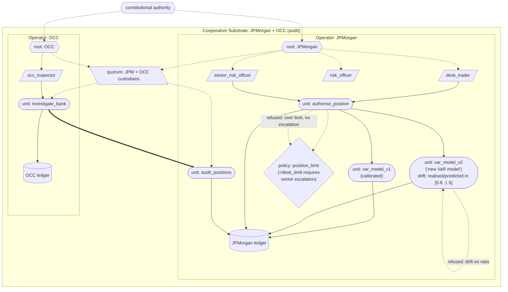

# JPMorgan London Whale

A model of the JPMorgan Chase 'London Whale' synthetic credit derivatives loss of 2012, built in the substrate. The substrate's unique contribution against this case is **drift detection on a behaviour-characterised risk model where the model's outputs diverged from realised portfolio behaviour, combined with structural escalation as a credential**. Where CrowdStrike exercises drift on a deployed software artefact, this case exercises drift on a financial model — the domain where regulated industries most need it.

## What this demonstrates

- **Confidence-as-architectural-property**: each VaR model declares a `confidence` section in its spec — produces=True, calibration claim, acceptance_band [0,1]. The unit produces a confidence value at runtime reflecting on-invocation calibration (how close realised P&L volatility is to the predicted figure).
- **Compiled confidence threshold via `confidence_gate`**: `trade_clearance` declares a `confidence_gate` in its spec with `minimum_confidence: 0.6`. The threshold is part of the unit's content_id; substituting a more lenient gate produces a new content_id, visible in audit. This is the architectural difference between "a threshold constant in a policy impl" and "a compiled policy threshold".
- **Scalar confidence aggregation through composition**: `authorise_position` declares `propagation: "minimum"`. The substrate runtime captures sub-unit confidences (VaR + clearance) during impl execution and injects the aggregated minimum into the unit's output. The impl does not compute the confidence; the substrate does. (This is scalar aggregation of reliability metadata, not distributional uncertainty quantification; the latter is domain library territory — see [docs/architectural_boundary.md](../../docs/architectural_boundary.md).)
- **Backtest closes the calibration loop**: a `backtest_var_calibration` unit walks the ledger, pairs predictions with realised P&L outcomes by `position_id`, computes the VaR exceedance rate (using `substrate.backtest.exceedance_rate`), refuses if the rate exceeds the declared bound for a 99% VaR. The refusal is on the ledger; an authorised operator (risk_officer) deprecates the target VaR model via an administrative act; deprecation propagates through the substrate's uniform invalidation surface. Every invalidation remains an explicit ledger event.
- **Content-addressed model recalibration**: replacing a VaR model with a recalibrated version produces a new content_id. Every risk figure on the ledger records which model produced it. Quiet recalibration is impossible.
- **Drift detection backstop**: the model declares a calibration criterion (realised-over-predicted volatility ratio in [0.8, 1.5] over a window). Systematic divergence trips drift; subsequent invocations refuse. Drift is the long-window backstop to per-invocation confidence.
- **Refer-to-human as a structural substrate output**: when confidence drops below the gate, the substrate refuses. The refusal is the refer-to-human signal — not a procedural recommendation a culture can override.
- **Escalation as a structural credential**: positions beyond the desk limit require a senior-risk escalation credential. The desk cannot self-issue the escalation; the principal who escalates is recorded on the ledger. Orthogonal to confidence.
- **Cross-operator regulator audit**: the OCC, as an audit operator under a cooperative substrate, produces forensic reports on its own ledger of every position attempted and every refusal — including the propagated confidence at each act.

## The case

Between January and April 2012, the Chief Investment Office (CIO) of JPMorgan Chase built a synthetic credit derivatives portfolio whose loss eventually reached approximately USD 6.2 billion. The trades were concentrated in the credit-default-swap index CDX.NA.IG.9 and related instruments, and were associated with one trader (Bruno Iksil, nicknamed 'the London Whale' for the size of his positions). The losses became public in May 2012; the Senate Permanent Subcommittee on Investigations published its canonical report 'JPMorgan Chase Whale Trades' in March 2013.

The substrate-relevant failure points (from the Senate report and subsequent regulatory findings):

1. **VaR model recalibration without proper validation**. The CIO replaced its existing VaR model with a 'new VaR model' in late 2011 that produced substantially lower risk figures on the same portfolio. The new model systematically underestimated risk relative to actual P&L volatility.
2. **Risk limits breached repeatedly**. The response was often to adjust the model (or the limit) rather than the position.
3. **Escalation to senior management was delayed and dampened**. Jamie Dimon's 'tempest in a teapot' comment in April 2012 reflected, in part, that the information reaching the CEO was filtered through layers that downplayed the situation.
4. **Refer-to-human as a decision was not structural**. There was no point at which the substrate of the trading process could refuse to authorise further position-taking; the controls were procedural and overridable.

## How the substrate is deployed

> Diagram conventions are listed in [docs/diagram_legend.md](../../docs/diagram_legend.md).



> Confidence flows substrate-natively: each VaR model produces a confidence value reflecting on-invocation calibration. `trade_clearance`'s `confidence_gate` (`minimum_confidence: 0.6`, part of the unit's content_id) refuses below threshold. `authorise_position` declares `propagation: "minimum"` and the runtime injects the propagated value into the unit's output. The same position notional under v1 (`risk_factor 0.04`) and v2 (`risk_factor 0.015`) produces very different predicted VaR figures; v2 produces low confidence against the actual P&L volatility, the gate refuses, and the position is not authorised. Drift on the realised/predicted ratio backstops over a window. A desk trader attempting a position above the declared desk limit is refused by `position_limit_policy` (orthogonal to confidence); the same position succeeds when invoked under `senior_risk_officer`. The OCC's `investigate_bank` cross-operator-invokes `audit_positions`; the forensic report carries each position's propagated confidence.

## What the substrate provides — mapped to each failure point

| London Whale failure | Substrate property |
|---|---|
| 1. VaR model recalibrated without validation | **Content-addressed model recalibration**. var_model_v1 and var_model_v2 have different content_ids; every risk figure on the ledger records which model produced it. A quiet recalibration is impossible. |
| 2. Per-invocation calibration ignored | **Confidence-as-architectural-property**. The VaR model's spec declares its confidence handling; the per-invocation confidence is structurally visible. trade_clearance's `confidence_gate` refuses below a compiled threshold. authorise_position propagates the minimum across sub-units. |
| 3. Risk limits breached, model adjusted to fit | **Drift detection as a backstop**. Persistent divergence between predicted and realised volatility trips drift; the drifted model refuses to size positions. Adjusting the model is itself producing a new content_id, visible in audit. |
| 4. Escalation delayed and dampened | **Escalation as a structural credential**. position_limit_policy refuses positions beyond the desk limit without a senior-risk credential. The desk cannot self-issue the escalation; the principal who escalates is recorded on the ledger. |
| 5. Refer-to-human not a structural output | **Refusal as first-class output**. A confidence-gate, drift, or limit refusal IS the refer-to-human signal. The substrate cannot be culturally bypassed; the refusal lands on the ledger and stops the invocation. |

What the substrate does **not** prevent: an institution choosing to set weak calibration bounds, weak position limits, or to authorise escalations as a matter of routine. The substrate makes the choice visible — the bounds and the escalations are themselves content-addressed and audit-traceable — but the choice is the institution's.

## Running it

```
python -m examples.london_whale.run
```

## Reading the output

1. **Setup** — two operators (JPMorgan, OCC), cooperative substrate for audit, two VaR models with different content_ids, drift criterion on each, position-limit policy bound via credential.
2. **Round 1**: routine position 500m under v1 (predicted VaR 20m). Permitted.
3. **Round 2**: same notional under v2 (predicted VaR 7.5m). The substitution is visible; the v2 act records the smaller VaR.
4. **Round 3**: a series of trades under v2 with realised P&L volatility significantly above v2's prediction. After four observations, drift fires; subsequent v2 invocations refuse with a drift rationale.
5. **Round 4**: desk trader attempts a position above the desk limit without escalation. `position_limit_policy` refuses.
6. **Round 5**: senior_risk_officer authorises the same position; the escalation credential is recorded on the act.
7. **Round 6**: the risk officer resets v2's drift state and resumes trading; 10 positions are authorised under v2 and realised P&L is reported; `backtest_var_calibration` finds a 30% VaR exceedance against a declared 5% bound and refuses; the operator deprecates `var_model_v2`; a subsequent position under v2 refuses.
8. **Round 7**: OCC cross-operator audit, run after the backtest and deprecation. The forensic report reconstructs the full sequence — both VaR models, the drift event, the over-limit refusal, the escalation, the backtest refusal, and the deprecation.

## What this verifies

The substrate's content-addressing, drift detection, structural escalation, and cross-operator audit commitments operate against a financial-model failure case. The unique architectural contribution against the London Whale is the combination of: drift detection on a risk model (catches systematic miscalibration regardless of why); content-addressed recalibration (recalibrations are visible events, not silent substitutions); and escalation as a credential (refer-to-human is a substrate output, not a procedural recommendation). The same primitives operate as in CrowdStrike (drift) and Robodebt (refer-to-human via policy refusal), but the case is structurally different: the drift is in a risk model's outputs rather than in a deployed software artefact; the consequence is financial loss, not a system outage; the escalation failure is the centre of the story.

What it does not verify:

- That institutions would deploy substrate-grade calibration bounds honestly. The substrate makes the calibration choices visible; the choices remain institutional.
- That regulators would invoke their audit rights if they had them. The substrate provides the structural place for the audit; whether it is invoked is a political question.
- That the institutional natural-person anchoring of escalation credentials to specific senior risk officers is real. The architectural mechanism is in `examples/constitutional_anchoring/`; the institutional apparatus that binds keypairs to specific humans is outside what code can verify.

The substrate's architectural answer to financial-model failures is: **the model is a content-addressed unit; its calibration is a declared property; deviation is detected and refused; recalibration is visible; escalation is a credential, not a procedure**. The London Whale case demonstrates that this answer operates in the financial domain in the same shape as it operates everywhere else.
