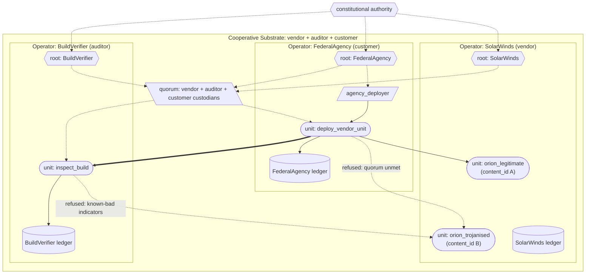

# SolarWinds (supply-chain compromise)

A model of the 2020 SolarWinds Orion supply-chain compromise, built in the substrate. Demonstrates the substrate's content-addressing and multi-custodian quorum commitments as the structural answer to "the vendor's signature alone is insufficient to validate a build."

## What this demonstrates

- **Content-addressing applied to build artefacts**: the Horizon correction extended to supply chains. A compromised build has a different content_id from the legitimate one; the vendor's signature does not change the content_id.
- **Multi-custodian quorum on deployment**: compiled forms can require witness from multiple independent custodians under a cooperative substrate. A compromised vendor cannot produce a quorum-valid witness without also compromising the independent custodians.
- **Cross-operator audit**: deployment events (including refusals) are recorded on all participating ledgers; evidence sharing across customers is structural rather than voluntary.

## The case

On 8 December 2020 FireEye (now Mandiant) disclosed that they had been compromised. Within days the source was traced back to SolarWinds: Russian state actors (SVR / APT29) had compromised SolarWinds' build pipeline between March and June 2020, inserting the SUNBURST backdoor into Orion network-management software updates. The trojanised builds were signed with SolarWinds' legitimate code-signing certificates and distributed through normal update channels.

Approximately 18,000 SolarWinds customers received the trojanised update. Confirmed victims included US federal agencies (Treasury, Commerce, DHS, State, Justice, Energy, NIH), most of the Fortune 500, and major IT/security companies (Microsoft, Cisco, Intel, FireEye, Deloitte, others). The malware lay dormant for two weeks after installation, then activated, sending DNS queries to attacker-controlled domains and providing remote access to compromised hosts. Detection came only because of an unrelated investigation triggered by anomalous network traffic.

The substrate-relevant failure points:

1. **Trust placed in vendor signature alone**. Customers validated updates by SolarWinds' code-signing certificate. The certificate was legitimate; the signature was valid. The build itself was malicious. Signature validation did not prevent the compromise.
2. **No independent witness of the build**. No third party inspected the artefact between SolarWinds' build and the customer's deployment. The vendor's word was structurally the only word.
3. **No behaviour monitoring**. SUNBURST's network behaviour (new DNS queries to specific domains) was not flagged because nobody had a baseline of what legitimate Orion should look like.
4. **No cross-customer evidence sharing**. Each affected organisation discovered the problem independently; intelligence about the compromise spread slowly through informal channels.

## How the substrate is deployed

> Diagram conventions are listed in [docs/diagram_legend.md](../../docs/diagram_legend.md).



> Each build artefact is its own state unit with its own content_id; substitution is structurally observable. The customer's deployment requires a quorum witness; the auditor's refusal to inspect-and-sign the trojanised build breaks the quorum, and the deployment is refused on the customer's ledger.

Three operators federated under a cooperative substrate:

| Operator | Role |
|---|---|
| `SolarWinds` (vendor) | publishes Orion builds |
| `BuildVerifier` (independent auditor) | inspects build artefacts before witnessing |
| `FederalAgency` (customer) | deploys vendor units only when both vendor and auditor have witnessed |

**Authority chain**:

```
constitutional authority
    |
    +--> SolarWinds (root)
    +--> BuildVerifier (root)
    +--> FederalAgency (root)
    |       \--> agency_deployer
    |
    +--> Cooperative substrate (vendor + auditor + customer)
```

**Units**:

- `orion_legitimate` (vendor's legitimate build, content-addressed)
- `orion_trojanised` (the malicious build, with a different content_id because its source bytes differ)
- `inspect_build` (BuildVerifier; inspects artefacts; refuses to witness if known-bad indicators present)
- `deploy_vendor_unit` (FederalAgency; calls `inspect_build` cross-operator before accepting deployment)

The cooperative substrate's quorum custodian witnesses cross-operator units. Customer policy: deployment requires the auditor's signature (without it, the cooperative-substrate quorum is unmet).

## What the substrate provides — mapped to each failure point

| SolarWinds failure | Substrate property |
|---|---|
| 1. Vendor signature trusted blindly | **Content-addressing of build artefacts**. The trojanised build's content_id is different from the legitimate build's. Customers deploying by expected content_id reject substitution structurally. |
| 2. No independent witness of the build | **Multi-custodian quorum via cooperative substrate**. The BuildVerifier's independent inspection is the structural choke point. A compromised vendor alone cannot produce a quorum-valid witness. |
| 3. No behaviour monitoring | **Drift detection on behaviour-characterised units**. If Orion's network behaviour (declared as a calibration criterion) deviated post-update, drift would fire. (Not exercised in this demonstration; the structural pattern is the same as in the Lavender and Robodebt examples.) |
| 4. No cross-customer evidence sharing | **Cross-operator audit**. The BuildVerifier's refusal is recorded on its own ledger; any other customer under the cooperative substrate can query it. Evidence sharing is structural. |

What the substrate does **not** prevent: a vendor compromise plus an auditor compromise. The substrate raises the bar to compromising N independent custodians simultaneously rather than 1. The quorum threshold sets the bar; here, 3 of 3 (vendor + auditor + customer) must witness. The architectural property is that the bar exists structurally rather than as a procedural recommendation.

## Running it

```
python -m examples.solarwinds.run
```

## Reading the output

1. **Setup** — three operators, cooperative substrate, two vendor artefacts with different content_ids.
2. **Deployment 1**: legitimate build. BuildVerifier inspects, finds no known-bad indicators, witnesses. Customer accepts deployment.
3. **Deployment 2**: trojanised build. BuildVerifier inspects, finds SUNBURST-style C2 hostnames, refuses to witness. Customer's deployment refused (cooperative-substrate quorum unmet).
4. **Audit**: customer ledger walk shows the accepted and refused deployments with the inspection act_ids cross-referenced.

## What this verifies

The substrate's content-addressing and multi-custodian quorum commitments handle the SolarWinds failure mode structurally. The architectural answer is not "trust the vendor more carefully"; it is "do not rely on a single party's witness for any deployment that affects you."

What it does not verify: that customers would actually require independent witnessing under operational pressure. The substrate makes the choice visible; operators choose whether to gate deployments on it.
