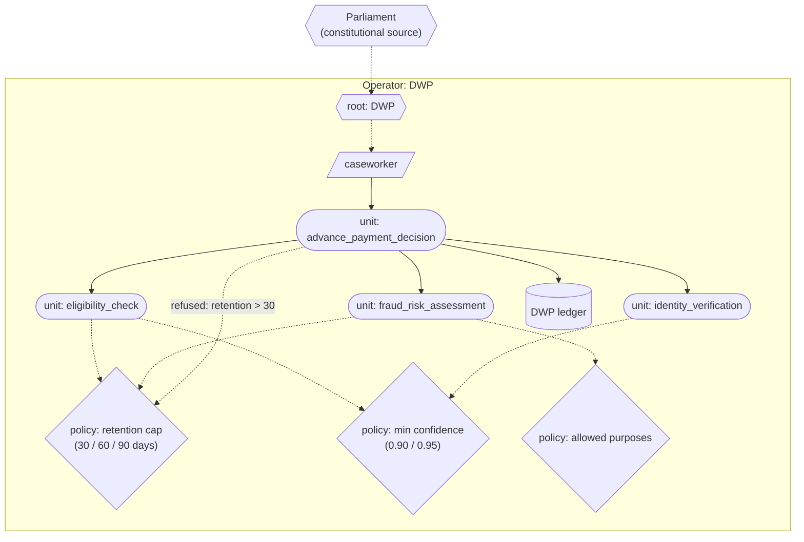

# Universal Credit (single operator)

A worked example of a UK Universal Credit advance payment decision composed of three sub-units under multiple policies, run on a single substrate operated by the Department for Work and Pensions (DWP).

## What this demonstrates

The substrate handling a real welfare decision composition end-to-end on a single operator. Specifically:

- Composing one functional unit out of three (eligibility check, fraud risk assessment, identity verification) with each contributing its own policies.
- Strictest-binding-wins emerging from refuse-wins across composed policies (the strictest retention cap, the highest confidence floor, the smallest allowed-purpose set).
- Each sub-unit declares a `confidence` section in its spec; `advance_payment_decision` declares `propagation: "minimum"` and the substrate runtime injects the propagated confidence into the composing unit's output. AND-composition: the decision is no more confident than its least confident sub-check.
- Compile-at-commit producing immutable content-addressed compiled forms with quorum-witnessable signatures.
- Structural type-checking refusing incomposable policies at compile time (the demonstration ends with a deliberately incomposable policy pair).
- Refusal as a first-class output, recorded on the ledger with a rationale naming the policy that refused.

This is not a failure-prevention case. It is the substrate's handling of an ordinary welfare composition, demonstrating the architectural pattern at the smallest interesting scale.

## The case

Universal Credit (UC) is the UK's principal working-age means-tested benefit. An "advance payment" is a loan paid to a new claimant before their first regular payment, repayable from future benefit. A DWP caseworker initiates the advance payment decision, which composes:

- **Eligibility**: is the household eligible for UC at all?
- **Fraud risk**: does the claim show indicators of fraudulent intent?
- **Identity**: has the claimant's identity been verified?

Each of these is governed by policies the DWP has committed to: how long data may be retained, what minimum confidence levels apply, what the data may be used for. Real welfare regulation imposes constraints on each.

## How the substrate is deployed

> Diagram conventions are listed in [docs/diagram_legend.md](../../docs/diagram_legend.md).



> Compile-time refusal: composing `retention <= 30` with `retention >= 90` raises `TypeMismatch` at compile-at-commit; no runtime invocation occurs (Case 6 in the demonstration).

**Operator**: a single DWP substrate.

**Authority chain**: Parliament (constitutional source) → DWP (institutional root) → caseworker credentials.

**Units**:

- `eligibility_check`, `fraud_risk_assessment`, `identity_verification` — three functional units, each with its own implementation (Python source as content-addressed state units).
- `advance_payment_decision` — the composing unit; its implementation invokes each sub-unit through `runtime.invoke()` and combines the outputs into a decision.

**Policies** (all functional units, brought into binding by credentials with `policy_refs`):

| Policy | Constraint |
|---|---|
| `retention_max_30_days`, `retention_max_60_days`, `retention_max_90_days` | data retention caps |
| `min_confidence_0_90`, `min_confidence_0_95` | confidence floors |
| `purposes_eligibility_only`, `purposes_eligibility_or_fraud`, `purposes_any_welfare` | allowed purpose sets |

Each sub-unit cites its own subset of policies. Composition rolls them all up under refuse-wins, giving the strictest combination at the parent unit.

**Structural preconditions** on policies (machine-readable in `spec["preconditions"]`): each policy declares the variable it constrains and the comparison; the compiler checks joint satisfiability across all policies in scope.

## What the substrate provides

The substrate's central commitments at work in this composition:

- **Compile-at-commit** produces an immutable compiled form for `advance_payment_decision` whose authority chain spans Parliament, DWP, and every binding credential, and whose policy list contains the eight policy unit content_ids.
- **Refuse-wins gives strictest-binding-wins** for free: when multiple retention caps are in scope (30, 60, 90 days), the 30-day policy is the first to refuse anything over 30, so the effective cap is 30. No special composition algorithm.
- **Refusal is first-class**: each refused invocation produces an Act on the ledger naming the policy that refused, with the policy's act_id linked so the audit trail follows back to the refusing unit.
- **Type-mismatch is caught at compile time**: Case 6 in the demonstration deliberately composes a policy requiring `max_retention_days <= 30` with one requiring `max_retention_days >= 90`. The compiler refuses to admit the composition, with a rationale naming the variable and the offending units.

## Running it

```
python -m examples.universal_credit.run
```

## Reading the output

The output walks through:

1. **Compiled form** — authority chain, policies in scope, witness signature.
2. **Cases 1-5** — invocations with various inputs:
   - Case 1: valid inputs, all policies permit, advance payment approved.
   - Case 2: retention beyond the rolled-up cap (30 days) — refused with rationale naming the 30-day policy.
   - Case 3: purpose outside the rolled-up allowed set — refused.
   - Case 4: confidence below the rolled-up floor — refused.
   - Case 5: invoking credential revoked — refused before any policy is invoked.
3. **Ledger** — every invocation (permits and refusals alike) produces an act; the chain is hash-verifiable end to end.
4. **Case 6** — incomposable policies refused at compile-at-commit (TypeMismatch), no runtime invocation occurs.
